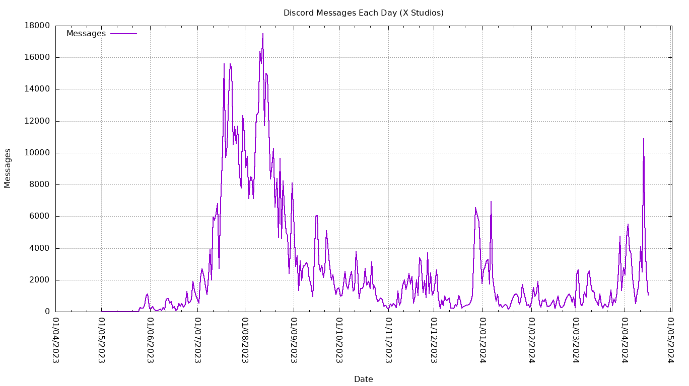

<!-- ABOUT THE PROJECT -->
## About the Project

I'm a massive statistics nerd, so what better way to fill my statistical needs than scraping the number of messages per day in **ANY** discord server **AND** plotting it on a graph!

<div align="center">
  <a href="https://github.com/axtan64/discord-counter">
    
  </a>


  <p align="center">
    Plot of my Discord Server, <a href="https://discord.gg/J5jpKBXfjP"><strong>X Studios!</a>
  </p>
</div>

<!-- GETTING STARTED -->
## Getting Started

Below contains the instructions in order to run the program.

### Prerequisites

The project makes use of gnuplot, python3 and curl, so it's likely that you will have to run it through a docker container. I have provided a Dockerfile which you can use to create an image which can host the project. 
* Make sure you have Docker Desktop installed <a href="https://www.docker.com/products/docker-desktop/">here</a>


Ensure docker is in your environment variables. You can check by running this in your command prompt.
  ```sh
  docker --version
  ```

### Running the Docker Container
After cloning the repository, navigate to the directory where you have the repository and run this command to create an image:
  ```sh
  docker build -t discord-counter .
  ```
  
Once built, run a docker container by running the command
  ```sh
  docker run -dit -v <path-to-repository>:/app/Shared discord-counter:latest
  ```
  
<!-- USAGE -->
## Usage
### Running the Program
Once the docker container has been opened, run `cd Shared` to navigate to the shared folder

Inside of the config.txt file, fill out the required fields (and any optional fields). This includes:
* Your Discord Token
* The Guild Id of the server you'd like to scrape
* The date you'd like to scrape from
* The date you'd like to scrape up to

And optionally:
* A specific Channel Id you'd only like to scrape

Run the command `./count.sh` inside of the docker container.

### File Outputs

The program will output two files upon completion of `./count.sh`, `results.csv` containing the raw data from the scrape, and `messages.png` containing the plotted data of the CSV.

Make sure to save these files in another directory before running `./count.sh` again if you'd like to keep them. They will be overwritten otherwise.